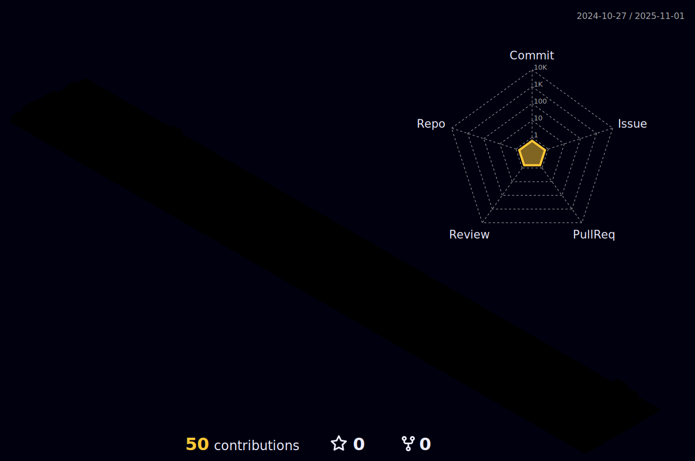

 

 
Turkish front-end developer who is exploring the world of <strong>JavaScript.</strong>
I am a computer engineer having more than 4 years of experience in programming languages.

🔵 Available for :
<strong>Team projects, ERP Projects, Web applications</strong>.

&nbsp;&nbsp;

